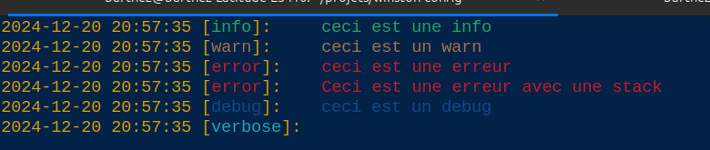

# Configuration des logs avec winston

**Winston** est une bibliothèque de journalisation (*logging*) pour Node.js, conçue pour être simple à utiliser, flexible, et extensible. Elle permet de gérer les logs de manière structurée et d'enregistrer les messages dans différents formats et vers plusieurs destinations (transports), telles que la console, des fichiers, des bases de données, ou encore des services distants.

## Caractéristiques principales de Winston

1- **Multiples transports** : Winston permet de définir plusieurs transports, ce qui signifie que les logs peuvent être envoyés simultanément vers différents supports, comme la console, des fichiers locaux, ou même des services comme Loggly, AWS CloudWatch, etc.

2- **Niveaux de log personnalisés** : Il permet de définir des niveaux de log comme info, warn, error, etc., et de filtrer les messages en fonction de leur importance.

3- **Formats flexibles** : Winston offre la possibilité de formater les logs selon les besoins : JSON, texte simple, ou encore des formats customisés. Cela permet d'adapter l'affichage pour le développement (par exemple avec des couleurs) ou pour la production (format plus formel comme JSON).

4- **Gestion des exceptions et promesses rejetées** : Il capture les erreurs non gérées et les rejets de promesses, assurant que rien ne passe inaperçu.

5- **Rotation des fichiers** : Grâce à des extensions comme winston-daily-rotate-file, Winston permet de faire tourner les fichiers de logs automatiquement en fonction de la taille ou de la date (ex : un fichier par jour).

## Ma configuration de Winston pour gerer les Logs

Dans cette configuration, nous utilisons Winston pour capturer les logs de différents niveaux (info, warn, error, debug), et les enregistrer dans des fichiers séparés avec rotation quotidienne pour éviter les fichiers trop volumineux. En production on filtre les logs a partir du niveau **debug** pour eviter de saturer... D'autre part nous gérons également l'affichage plus simplifié en developpement avec un format coloré et simplifié dans a console de developpement. Voici les détails :

```typescript
import winston, { createLogger, format, transports } from 'winston';
import DailyRotateFile from 'winston-daily-rotate-file';
import { envs } from './env';

const { colorize, align } = winston.format;

// Fonction de configuration pour la rotation quotidienne des fichiers de logs
const createTransport = (filename: string, level: string, maxFiles: number) => {
    return new DailyRotateFile({
        filename: `logs/${filename}-%DATE%.log`, // Nom du fichier basé sur le niveau
        datePattern: 'YYYY-MM-DD', // Format de la date
        zippedArchive: true, // Archiver les anciens fichiers en zip
        maxSize: '30m', // Taille maximale du fichier de log
        maxFiles: `${maxFiles}d`, // Nombre maximum de jours à conserver
        level // Niveau de log (si spécifié)
    });
};

// Definir le niveau de log en fonction de l'environement... Ceci pour filtrer certains log et ne pas les envoyer en production 
const logLevel = envs.NODE_ENV === 'production' ? 'info' : 'debug';

// Transporteur pour les log généraux
const transport = createTransport('application', 'info', 14);

// Transporteur pour les log de warn
const warnTransport = createTransport('warns', 'warn', 21);

// Transporteur pour les log de debug
const debugTransport = createTransport('debugs', 'debug', 21);

// Transporteur pour les log d'erreur
const errorTransport = createTransport('errors', 'error', 30);

/**
 * Crée un logger Winston configuré pour enregistrer les logs dans des fichiers avec rotation quotidienne.
 * Gère à la fois les logs généraux, les logs de warning et les logs d'erreurs.
 * Les exceptions non capturées et les promesses rejetées sont également traitées.
 */
const log = createLogger({
    level: logLevel,
    format: format.combine(
        format.timestamp({
            format: 'YYYY-MM-DD HH:mm:ss' // Format de la date dans les fichiers
        }),
        format.errors({ stack: true }), // pour afficher les stacks des erreurs
        align(), //method aligns the log messages
        envs.NODE_ENV === 'production' // gerer l'affichage des logs en fonction de l'environnement de dévéloppement
            ? format.json() // Production : logs au format JSON
            : format.prettyPrint() // Développement : logs plus lisibles
    ),
    defaultMeta: {
        service: 'user-service'
    },
    transports: [
        envs.NODE_ENV === 'production' ?
            new transports.Console({
                format: format.combine(
                    format.timestamp(),
                    format.json() // JSON output pour la console aussi
                ),
                level: 'info' // On affiche seulement 'info' et supérieur en production
            })
            :
            new transports.Console({
                format: format.combine(
                    colorize({ all: true }),
                    format.printf(({ level, message, timestamp }) => {
                        return `${timestamp} [${level}]: ${message}`;
                    })
                ),
                level: 'debug' // On affiche tous les niveaux en développement
            }), // pour afficher les logs dans la console
        transport, // Logs généraux avec rotation quotidienne
        errorTransport, // Fichier dédié pour les error avec rotation
        warnTransport, // Fichier dédié pour les warn avec rotation
        debugTransport, // Fichier dédié pour les warn avec rotation
    ],
    exceptionHandlers: [
        new transports.File({ filename: 'logs/exceptions.log' }) // Capture les exceptions non interceptées pour éviter que l'application ne se termine de manière inattendue
    ],
    rejectionHandlers: [
        new transports.File({ filename: 'logs/rejections.log' }) // Capture les promesses rejetées
    ]
});

export default log;
```

exemple de log:

```typescript
 log.info("ceci est une info")
 log.warn("ceci est un warn")
 log.error("ceci est une erreur")
 log.debug("ceci est un debug")
 ```

resultat dans la console:


## Configurer Morgan avec Winston

Pour capturer les requêtes HTTP, on peut intégrer Morgan (un middleware de journalisation pour Express) avec Winston, en redirigeant les logs HTTP vers Winston. Voici comment le configurer :

```typescript
import morgan from 'morgan';
import log from './core/config/logger';

// Middleware de journalisation avec Morgan qui utilise Winston
app.use(morgan('combined', {
 stream: {
  write: (message) => log.http(message.trim()) // Redirige les logs HTTP vers Winston
 }
}));
// ici app est une instance d'express (```const app = express();```)
 ```

Dans cet exemple, Morgan redirige les logs HTTP vers Winston pour une gestion centralisée et un formatage flexible des requêtes réseau.

## Astuce: Desactiver Console en production

Les console.log et console.warn ne doivent pas être utilisés en production car ils peuvent nuire aux performances en générant du bruit inutile dans les logs. Ils peuvent également exposer des informations sensibles, compromettant la sécurité. De plus, ils manquent de fonctionnalités avancées comme la gestion des niveaux de log et la rotation des fichiers, ce qui rend difficile le suivi des erreurs et la maintenance. Utiliser un logger comme Winston permet un meilleur contrôle et une gestion plus professionnelle des logs en production. Il est donc plus jusdicieux de les desactiver si jamais ils ont été glissé dans le code durant le dévéloppement...

Voici un exemple de façon de le desactiver en production en configurant un midddleware...

```import { envs } from "@src/core/config/env";
import { Request, Response, NextFunction } from "express";

const disableLogsInProduction = (req: Request, res: Response, next: NextFunction) => {
    if (envs.NODE_ENV === 'production') {
        console.log = () => { };
        console.warn = () => { };
        console.error = () => { };
        console.info = () => { };
        console.debug = () => { };
    }
    next();
};

export default disableLogsInProduction;
```

puis l'utiliser dans le fichier des configuration ou du serveur...

```typescript
import express from 'express';
import disableLogsInProduction from './middleware/disableLog';

const app = express();

// Desactiver les logs de console en production
app.use(disableLogsInProduction); // Middleware pour désactiver les logs
```

**Merci pour la lecture :-)**
[Barthez Kenwou](https://www.linkedin.com/in/barthez-kenwou/?)
